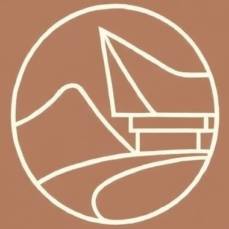

# 🏔️ Toraja Hill Stop

**Aesthetic Website for Your Guesthouse. Built in Hours, Not Weeks.**



---

## 🤔 The Problem: Hospitality Business Without Digital Presence

Many guesthouses, homestays, and small accommodations are stuck with:

1. **No website at all** — Relying solely on OTAs (Booking.com, Airbnb) that take 15-20% commission.
2. **Generic templates** — Stiff designs that fail to capture the beauty and uniqueness of their place.
3. **Complicated booking process** — Potential guests don't know how to reach out.

> *"If my place is this beautiful, why doesn't my website reflect that?"*

---

## ✨ The Solution: Toraja Hill Stop

A modern, aesthetic, and mobile-friendly website that:

- 🎨 **Design that reflects character** — Warm terracotta colors, elegant typography, calming mountain vibes
- 📱 **100% Responsive** — Looks perfect on mobile, tablet, and desktop
- 💬 **WhatsApp Booking** — One click to connect directly with the owner, zero OTA commissions
- 📊 **Booking Tracking** — Every inquiry saved to database for analysis
- ⚡ **Blazing Fast** — Built with React & Vite, loads in milliseconds

---

## 🖼️ Key Features

### 🏠 Stunning Landing Page
- Hero section with breathtaking mountain scenery
- Interactive gallery with smooth hover effects
- Google Maps integration for location

### 📝 Simple Booking Form
- Intuitive guest input fields
- Automatic price calculation
- Direct WhatsApp connection with pre-formatted messages

### 🎯 SEO Ready
- Optimized meta tags
- Semantic HTML structure
- Fast loading for better Google rankings

---

## ⚡ Built in Hours, Not Weeks

Yes, you read that right.

A website this professional **doesn't require weeks of development**. With modern tools and the right expertise, an aesthetic website for your business can go live in **a single working day**.

| Traditional Approach | With Me |
|---------------------|---------|
| 2-4 weeks development | **< 1 day** |
| Multiple meetings | Quick chat via WhatsApp |
| Endless revisions | Real-time iterations |
| Budget in thousands | **Very affordable** |

---

## 🛠️ Tech Stack

Built with modern, battle-tested technologies:

- **Framework:** React 18 + Vite
- **Styling:** Tailwind CSS + shadcn/ui
- **Backend:** Lovable Cloud (Supabase)
- **Icons:** Lucide React
- **Typography:** Playfair Display + Inter

---

## 💎 Want a Similar Website for Your Business?

Do you own:
- 🏡 Guesthouse / Homestay / Villa
- ☕ Cafe with aesthetic views
- 🍽️ Restaurant with unique ambiance
- 🏪 Local business needing online presence

**Don't let your business fall behind just because you lack a proper website.**

### 📩 Contact Me Now

<a href="https://www.linkedin.com/in/doltons-edward-nicholas-p/" target="_blank">
  
</a>

👉 **[Chat on LinkedIn](https://www.linkedin.com/in/doltons-edward-nicholas-p/)** — Tell me about your business, and I'll help bring your dream website to life.

---

## 🚀 Quick Start (Development)

```sh
# Clone repository
git clone <YOUR_GIT_URL>

# Install dependencies
npm install

# Run development server
npm run dev
```

---

## 📄 License

MIT License - Feel free to use as inspiration for your own projects.

---

<p align="center">
  <i>Made with ☕ and love in Indonesia</i>
</p>
